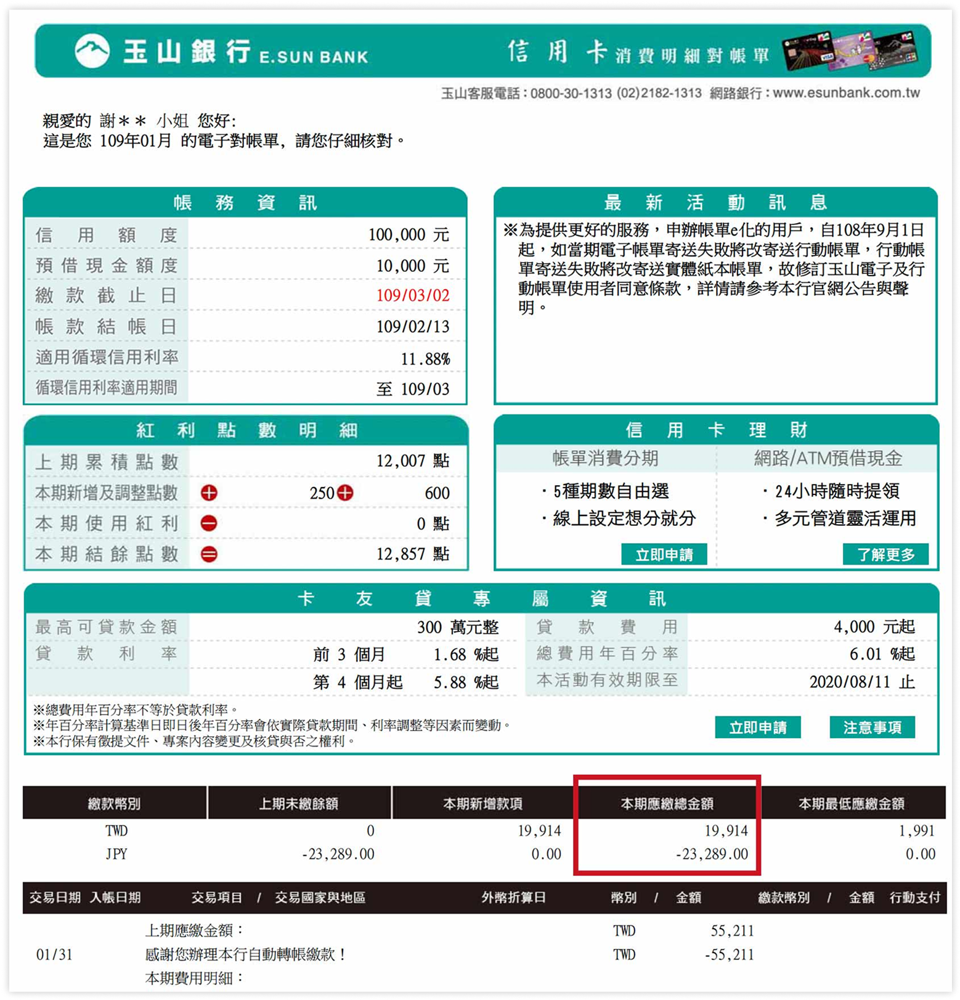
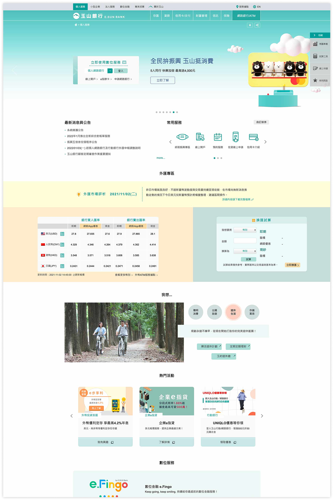

# Brand 品牌介紹
## 貼近 - 設身處地{.color-primary-6}
### 在數位服務上詮釋「貼近」
- 根據顧客的需求先想一步，提供的訊息需經過整體規劃
- 用日常語言解釋複雜金融，縮短銀行和顧客間距離
- 應以滿足顧客需要為主要訴求，勿以產品行銷、優惠為主軸

### 在設計上詮釋「貼近」
- 做到設計的通用性，包含顏色對比度、文字、按鈕大小等
- 設計需具有易用性和可理解性，能夠讓使用者完成期待中的任務，並且擁有積極和愉悅的用戶體驗
- 使用使用者懂的意象，參照真實世界的事物、邏輯幫助使用者理解

> 範例：以顧客角度為出發點，資訊層級應以直覺式的分類呈現

  

    

        <h4 style="color: #009973;">正確範例︎ ✓</h4>
        
    

    

        <h4 style="color: #C92E34;">錯誤範例 ︎✘</h4>
        
    

  

## 信任 - 誠信正直{.color-blue-7}
### 在數位服務上詮釋「信任」
- 讓顧客隨時知道辦理、查詢的進度到哪邊，不讓顧客迷航
- 提供充足且必要的資訊，並正面回答顧客問題
- 勿使用具爭議性的話題、人物，回歸本質以金融專業為核心

### 在設計上詮釋「信任」
- 在選圖上，使用正面表述與合適年齡層的情境素材，例如：專業團隊、明亮天空、壯闊山景等，避免營造出負面與幼稚的情境
- 顧客需要的資訊放在最明顯的地方，不遮掩、不模糊焦點
- 提供清楚的各狀態訊息，讓使用者了解「現在發生了什麼事」

> 範例：以顧客角度為出發點，資訊層級應以直覺式的分類呈現

  

    

        <h4 style="color: #009973;">正確範例︎ ✓</h4>
        
    

    

        <h4 style="color: #C92E34;">錯誤範例 ︎✘</h4>
        
    

  

## 簡約 - 簡單明瞭{.color-gray-7}
### 在數位服務上詮釋「簡約」
- 在產品/服務資訊、功能呈現上，分類邏輯一致，層級、架構清楚易懂  
- 盡最大努力讓顧客操作流程精簡，省時省心不費力  
- 沒有過多的形容詞，簡潔、重點、一目瞭然  

### 在設計上詮釋「簡約」
- 配色層次清楚，以留白為主沒有過多裝飾  
- 在排版上規範明確的文字大小、行距以及字重，確保資訊的閱讀性  
- 使用有規則的格線系統，不僅能讓畫面具有整齊性，也能引導視覺流向，讓使用者更流暢地接收資訊  

> 範例：以顧客角度為出發點，資訊層級應以直覺式的分類呈現

  

    

        <h4 style="color: #009973;">正確範例︎ ✓</h4>
        
    

    

        <h4 style="color: #C92E34;">錯誤範例 ︎✘</h4>
        
    

  

