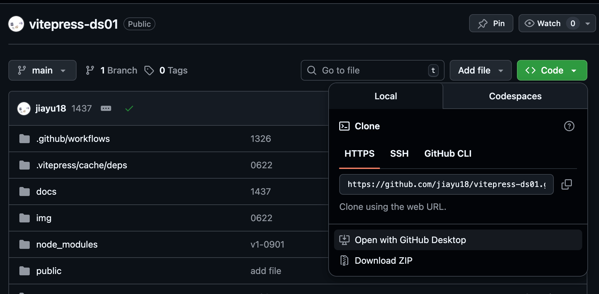
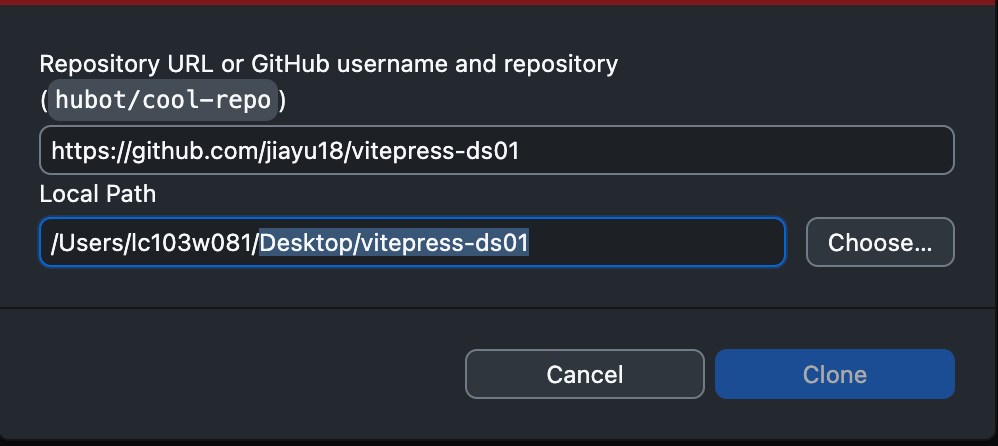
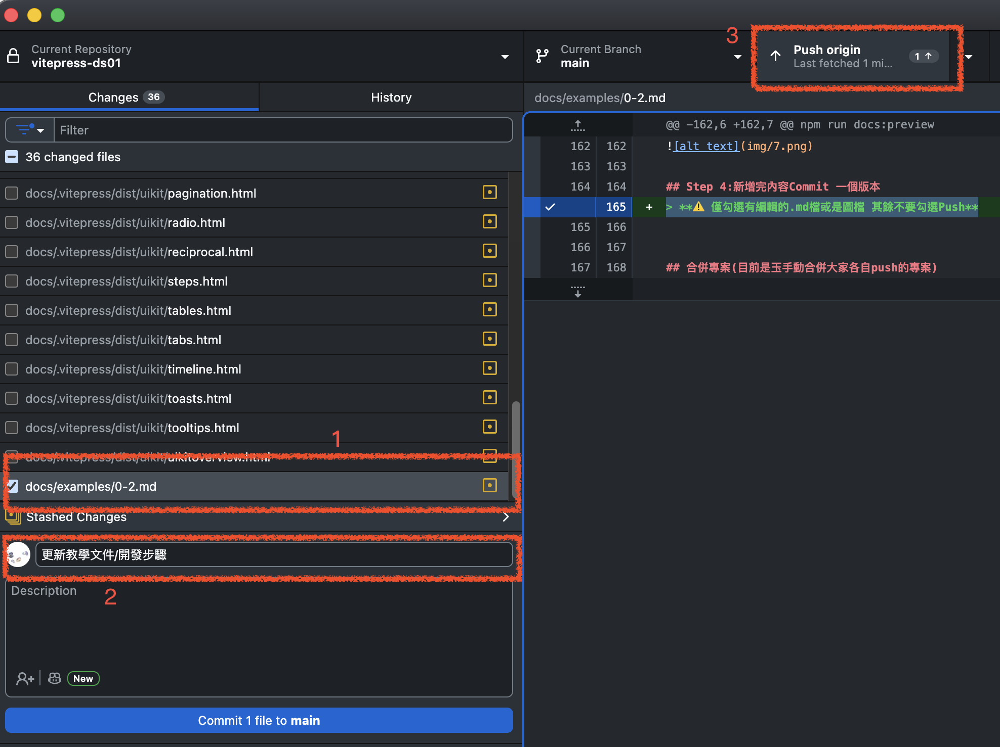
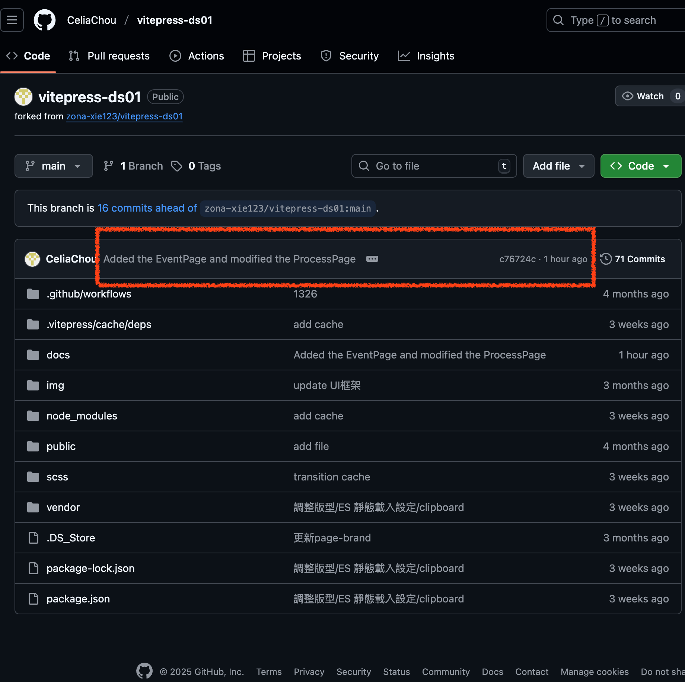
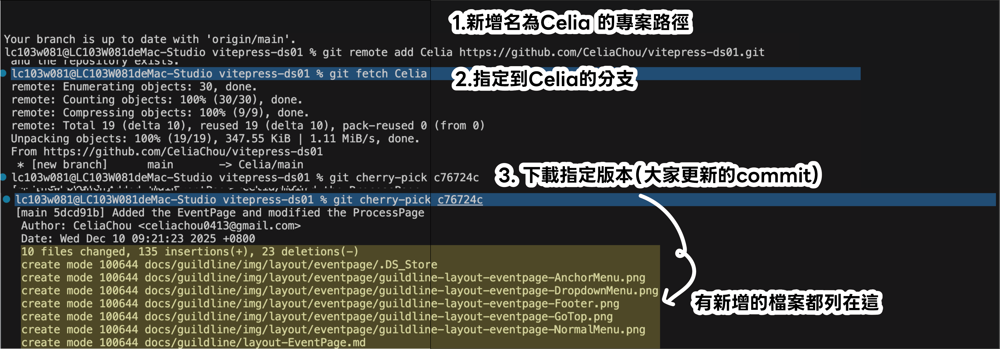
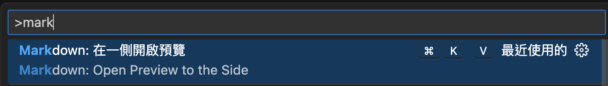

# MD檔開發步驟/部署
### [專案連結-vitepress-ds01](https://github.com/jiayu18/vitepress-ds01)
12/10:最新檔會定期存放於公槽 `/D5-16 銀行網頁/18 DesignSystem/2026` （因資安建議 已將原網址專案設為私人）

| 上稿路徑                          |                      |
| --------------------------------- | -------------------- |
| {width=50%} | 編輯裡面已建好的MD檔 |
|                                   |                      |
## Step 1：頁面從Github Desktop clone專案到`本機桌面`



## Step 2-1：安裝擴充 **Markdown All in One**

### 安裝方式
1. 按 `Ctrl+Shift+X`（Mac：`Cmd+Shift+X`）開啟擴充功能頁面
2. 搜尋「**Markdown All in One**」
3. 點擊 **Install** 安裝
4. 重新打開 VS Code

#### 基本功能測試

安裝完成後，在任何 `.md` 檔案中可以使用：

- `Ctrl+B`：加粗文字
- `Ctrl+I`：斜體文字
- `Alt+Shift+F`：格式化表格
- `Ctrl+Shift+]`：切換標題級別

## Step2-2：設定元件快捷鍵 安裝**Snippets**
### 開啟 Snippets 設定

1. 按 `Ctrl+Shift+P`（Mac：`Cmd+Shift+P`）開啟命令面板
2. 輸入並選擇「**Preferences: Configure User Snippets**」
3. 選擇下拉選單的「**markdown**」後，會跳到markdown.json檔案中

### **🌟目前常用標籤** 

在開啟的 `markdown.json` 檔案中貼上以下配置：

```json
{
	"頁籤": {
	"prefix": "/tab",
	"body": [
	"::: code-group",
	"```html [html]",
	"<a class='btn' href='#'>範例按鈕</a>",
	"```",
	"```css [css]",
	"import type { UserConfig } from 'vitepress'",
	"const config: UserConfig = {",
	"// ...",
	"}",
	"export default config",
	"```",
	":::"
	],
	"description": "插入TAB"
	},
	"提示框": {
		"prefix": "/tip",
		"body": [
			"> **💡 提示**",
			"> $1"
		],
		"description": "插入提示框"
	},
	"警告框": {
		"prefix": "/warn",
		"body": [
			"> **⚠️ 警告**",
			"> $1"
		],
		"description": "插入警告框"
	},
	"程式碼區塊": {
		"prefix": "/code",
		"body": [
			"```$1",
			"$2",
			"```"
		],
		"description": "插入程式碼區塊"
	},
	"表格": {
		"prefix": "/table",
		"body": [
			"| ${1:標題1} | ${2:標題2} | ${3:標題3} |",
			"|----------|----------|----------|",
			"| ${4:內容1} | ${5:內容2} | ${6:內容3} |",
			"| $7 | $8 | $9 |"
		],
		"description": "插入3欄表格"
	},
	"待辦清單": {
		"prefix": "/todo",
		"body": [
			"- [ ] ${1:待辦事項1}",
			"- [ ] ${2:待辦事項2}",
			"- [ ] ${3:待辦事項3}"
		],
		"description": "插入待辦清單"
	},
	"折疊區塊": {
		"prefix": "/details",
		"body": [
			"<details>",
			"<summary>${1:點擊展開}</summary>",
			"",
			"$2",
			"",
			"</details>"
		],
		"description": "插入可折疊區塊"
	},
	"日期時間": {
		"prefix": "/date",
		"body": [
			"📅 ${CURRENT_YEAR}-${CURRENT_MONTH}-${CURRENT_DATE} ${CURRENT_HOUR}:${CURRENT_MINUTE}"
		],
		"description": "插入當前日期時間"
	}
}
```


### 使用方式

儲存後，在 Markdown 檔案中：

1. 輸入 `/tip` 然後按 `Tab` → 自動展開提示框
2. 輸入 `/code` 然後按 `Tab` → 展開程式碼區塊並可選擇語言
3. 輸入 `/table` 然後按 `Tab` → 展開表格模板
4. 按 `Tab` 可在預設位置間跳轉填入內容

----
## Step 3：開發

`control+c` 跳開終端機執行

1.安裝
```
npm install vitepress
```
2.安裝完後 確認版本為vitepress@1.6.4
```
npm list vitepress
```
3.執行
```
npm run docs:build
```
4.預覽
```
npm run docs:preview
```

[部署完的預覽連結http://localhost:8080/vitepress-ds01/](#)

## Step 4:新增完內容Commit 一個版本
> **⚠️ 僅勾選有編輯的.md檔或是圖檔 其餘不要勾選Push**

到桌機版 Github Desktop push專案更新版本

可回到github檢視自己的專案更新狀況


## 合併專案(目前是玉手動合併大家各自push的專案)
在 Terminal 下指令：

bash
#### 1. 進到你的repo（如果還沒 clone 就先 clone）
```
git clone git@github.com:you/your-private-repo.git
```
```
cd your-repo
```
#### 2. 切到你要併入的分支（例如 main）
```
git checkout main
```
#### 3. 加 [小玉] 的 repo 當 remote（只需加一次）
```
git remote add 小玉 https://github.com/小玉/repo1.git
```
#### 4. 把 小玉 的 main 抓下來
```
git fetch 小玉
```
#### 5. 從 小玉 的 main cherry-pick 那顆 commit（例如c76724c）
```
git cherry-pick c76724c
```
如果過程沒有 conflict，完成後直接push專案：
```
git push origin main
```
以上步驟就能就把 c76724c 那版commit 的更新，完整併回主專案的的repo 了。
如果 cherry-pick 時有衝突：
bash
###### 修好所有衝突檔案後
```
git add .
git cherry-pick --continue
git push origin main
```



## 編輯Md檔時 可以及時預覽方式
`⌘+SHIFT+P`搜尋預覽 or 自訂快捷鍵



	::: code-group
	```js [config.js]
	export default config

	```ts [config.ts]
	import type { UserConfig } from 'vitepress'
	const config: UserConfig = {
	// ...
	}
	export default config
	``` :::


### 附錄
#### Markdown 與 HTML 標籤比較

以下是 Markdown 與 HTML 標籤的比較，方便理解兩者的對應關係：

| 功能           | Markdown 語法                   | 對應的 HTML 標籤                       | 範例                                                                       |
| -------------- | ------------------------------- | -------------------------------------- | -------------------------------------------------------------------------- |
| **標題**       | `# H1`, `## H2`, `### H3`       | `<h1>`, `<h2>`, `<h3>`                 | `# 標題` → `<h1>標題</h1>`                                                 |
| **粗體**       | `**文字**` 或 `__文字__`        | `<strong>` 或 `<b>`                    | `**粗體**` → `<strong>粗體</strong>`                                       |
| **斜體**       | `*文字*` 或 `_文字_`            | `<em>` 或 `<i>`                        | `*斜體*` → `<em>斜體</em>`                                                 |
| **無序清單**   | `- 項目`、`* 項目`              | `<ul><li>項目</li></ul>`               | `- 項目` → `<ul><li>項目</li></ul>`                                        |
| **有序清單**   | `1. 項目`                       | `<ol><li>項目</li></ol>`               | `1. 項目` → `<ol><li>項目</li></ol>`                                       |
| **連結**       | `[文字](URL)`                   | `<a href="URL">文字</a>`               | `[Google](https://google.com)` → `<a href="https://google.com">Google</a>` |
| **圖片**       | ``          | `` | `` → ``                    |
| **行內程式碼** | `` `程式碼` ``                  | `<code>程式碼</code>`                  | `` `print()` `` → `<code>print()</code>`                                   |
| **區塊程式碼** | ```三反引號 + 語言\n程式碼\n``` | `<pre><code>程式碼</code></pre>`       | ```<br>code<br>``` → 對應以上標籤                                          |
| **引用**       | `> 文字`                        | `<blockquote>文字</blockquote>`        | `> 引用` → `<blockquote>引用</blockquote>`                                 |
| **水平線**     | `---`、`***`、`___`             | `<hr />`                               | `---` → `<hr />`                                                           |

## 總結

- Markdown 結構簡單，適合快速書寫和閱讀純文字內容。
- HTML 功能完整且彈性高，可控制更多細節與樣式。
- Markdown 最後會被轉換成對應的 HTML 結構來顯示。

## 版更紀錄
### 2025/9/19
1. 引入BS4.6
2. 建立vue 元件
3. md檔使用vue元件
4. 教學頁建置
5. 引入圖庫
### 2025/12/10
1. 調整存取個別github Repo專案的方式
   