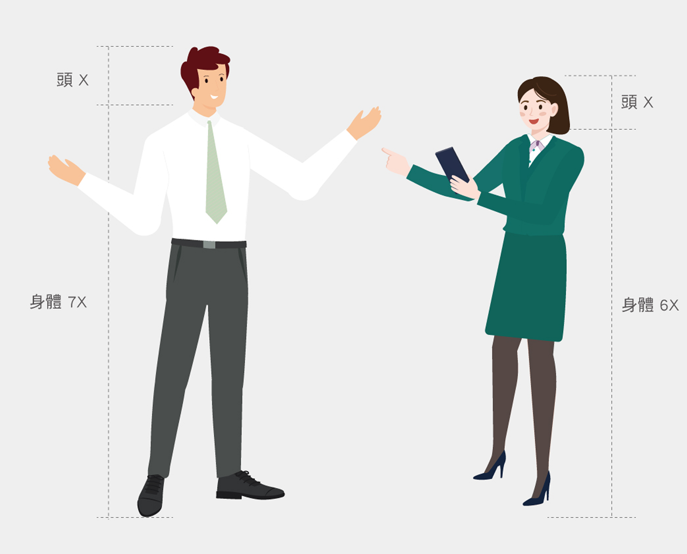
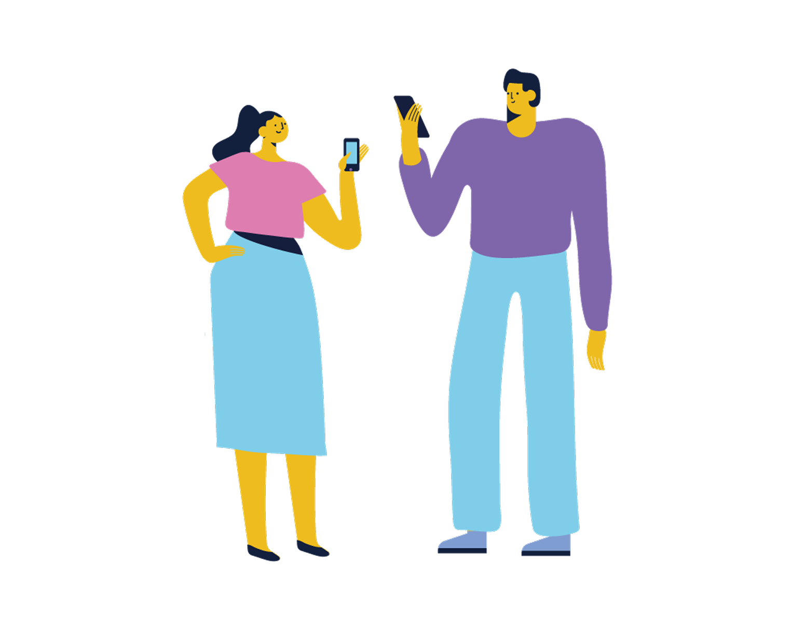
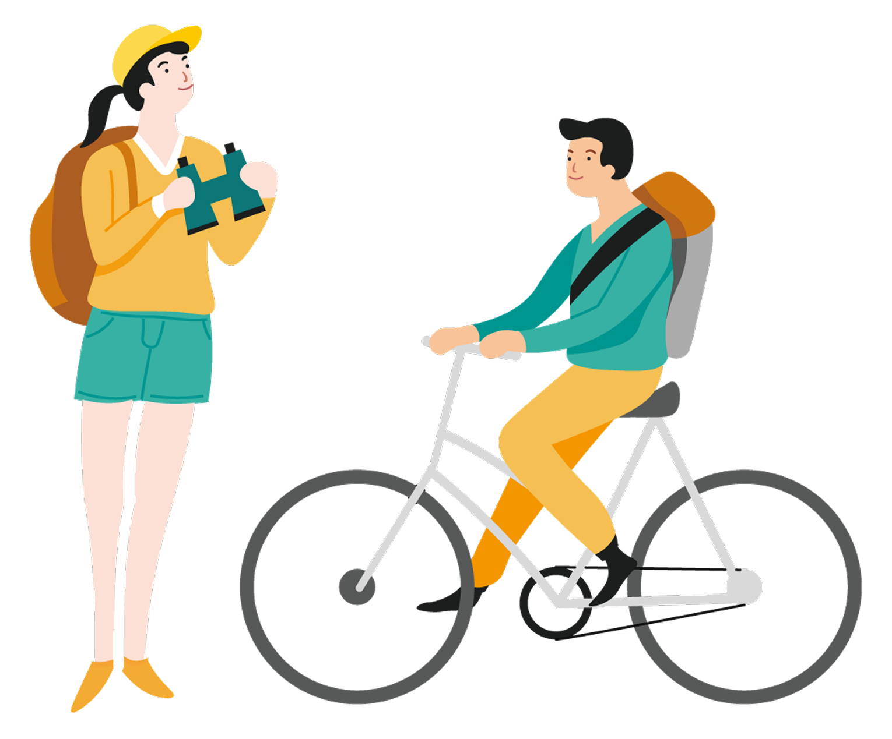
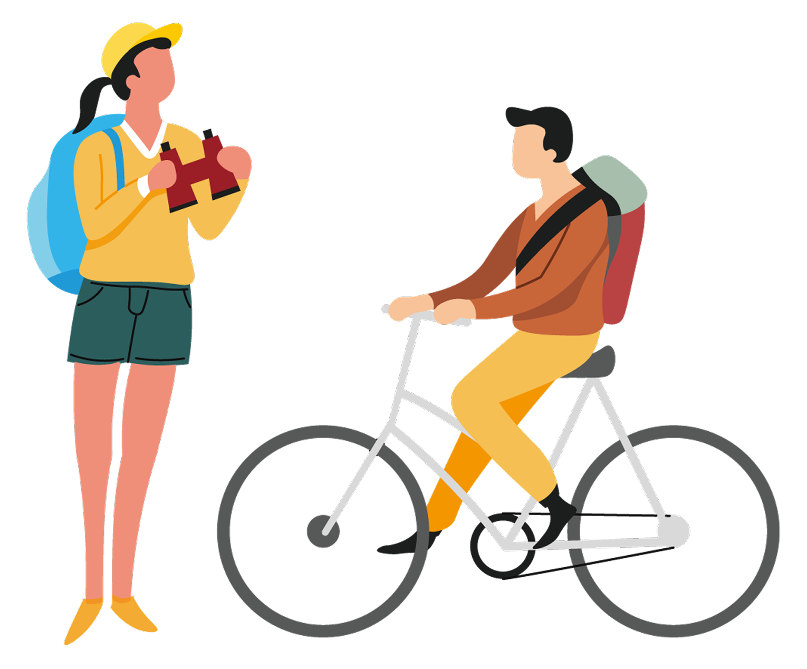
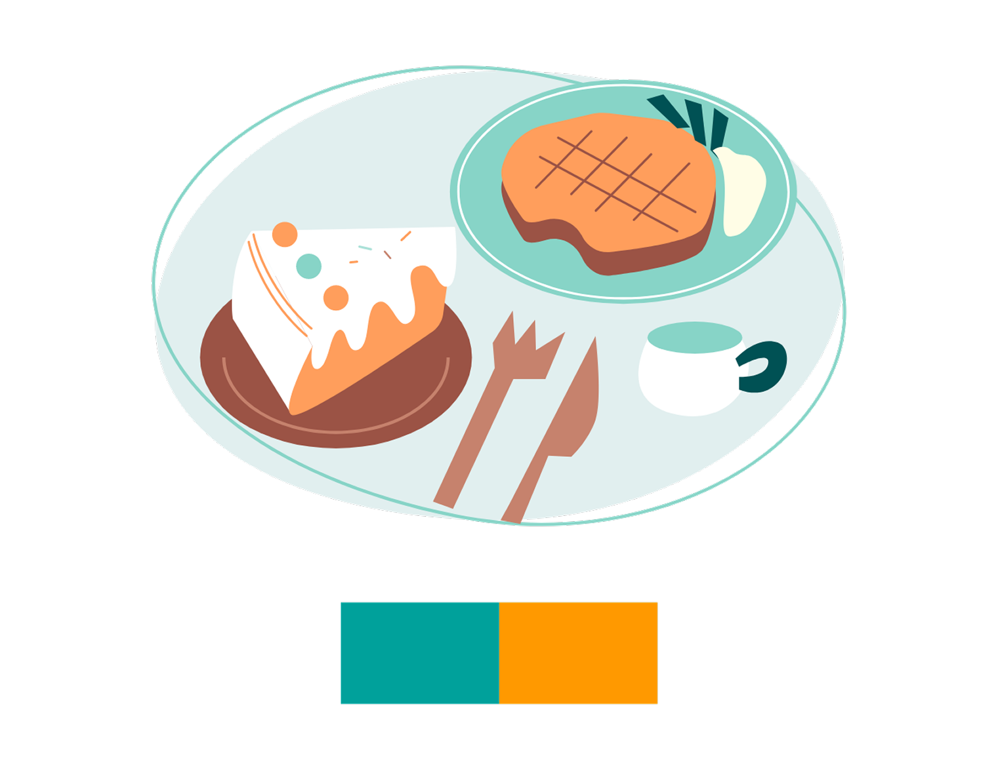
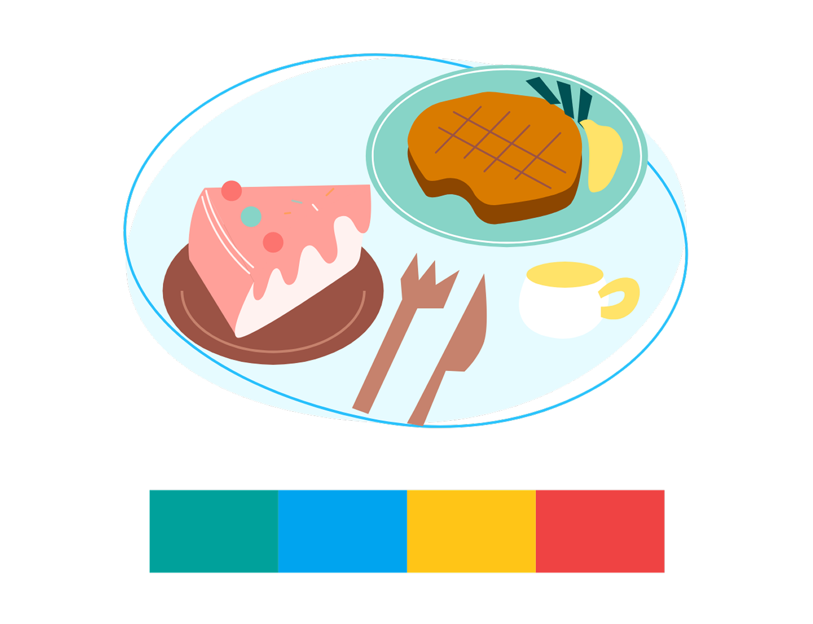

# Illustration 插圖
>將文字內容、故事或思想以視覺化的方式呈現同時塑造情感背景，使用户更具沉浸感。

## 人物設計規範

合理的人物比例： 
人類的成人頭身比例大致在六至八頭身之間，運用合理的人體比例，避免誇張的比例，以展現安定、信賴感。

  

    

        
正確

        
    

    

        
錯誤

        
    

  

膚色建議

 

        

            

                

                    

                        #fbe0d6
                    

                    
複製

                

            

            

            <!-- $primary-6 -->
            

                

                #f8c499
                

                
複製
                

            

        

    

配色： 
需使用企業綠搭配出自Design system的顏色，除膚色與中性色(黑灰白)以外，可以再選擇兩個色系做搭配。

  

    

        
正確

        
    

    

        
錯誤

        
    

  

人物五官： 
藉由人物的五官傳達信賴感、親和力，無五官人像易產生冷漠、疏離感，需避免使用。

  

    

        
正確

        
    

    

        
錯誤

        
    

  

## 物品設計規範

配色： 
需使用企業綠搭配出自Design system的顏色，除中性色(黑灰白)以外，可以再選擇1-2種色系搭配。 
＊除企業色外，顏色須控制在兩色內，可自由運用該色系之深淺色

  

    

        
正確

        
    

    

        
錯誤

        
    

  

