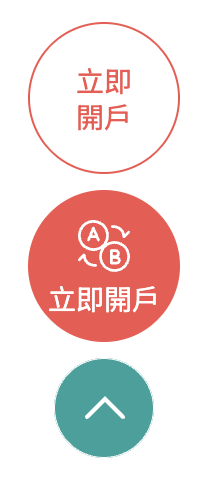

# 行銷頁面 eventpage
> 為使行銷活動可多元呈現，並擁有一致性的操作體驗，對於行銷頁面的Header、Footer功能頁面進行規範。 
>  [➚ Figma](https://www.figma.com/design/omxTr5PtVk1GtGg4RkQJlM/layout%E7%9B%A4%E9%BB%9E?node-id=1-55&m=dev){.color-primary-6}

## Header

    <table class="table table-bordered w1000">
        <thead class="bg-primary-8">
            <tr>
                <th scope="col">種類</th>
                <th scope="col">一般選單</th>
                <th scope="col">下滑錨點</th>
                <th scope="col">下拉選單</th>
            </tr>
        </thead>
        <tbody>
            <tr>
                <td width="10%" class="bg-primary-2">
                    
示意

                </td>
                <td width="30%">
                    
                </td>
                <td width="30%">
                    
                </td>
                <td width="30%">
                    
                </td>
            </tr>
            <tr>
            <td>
            說明
            </td>
            <td colspan="3">
            依照需求不同表頭使用。
            </td>
            </tr>
        </tbody>
    </table>

## Footer

    <table class="table table-bordered w1000">
        <thead class="bg-primary-8">
            <tr>
                <th scope="col">種類</th>
                <th scope="col">公版表尾</th>
            </tr>
        </thead>
        <tbody>
            <tr>
                <td width="10%" class="bg-primary-2">
                    
示意

                </td>
                <td>
                    
                </td>
            </tr>
            <tr>
                <td>
                    說明
                </td>
                <td>
                    依據現行規範，各網頁Footer皆統一，但可根據是否有提到警示內容，決定是否需要加入警語。
                </td>
            </tr>
        </tbody>
    </table>

## 浮動按鈕

    <table class="table table-bordered w1000">
        <thead class="bg-primary-8">
            <tr>
                <th scope="col">類別</th>
                <th scope="col">步驟圖示意</th>
            </tr>
        </thead>
        <tbody>
            <tr>
                <td width="10%" class="bg-primary-2">
                    
示意

                </td>
                <td>
                    
                </td>
            </tr>
            <tr>
                <td>
                    說明
                </td>
                <td>
                    根據需求看要不要放上浮動按鈕，有分為線框、色塊兩種形式，並可根據需求加入icon。 
                    字數限制為每顆按鈕數字不得超過4字，手機版改變成為置底按鈕形式。 
                    如不需使用則皆可隱藏，只留下回到首頁上滑按鈕。
                </td>
            </tr>
        </tbody>
    </table>

