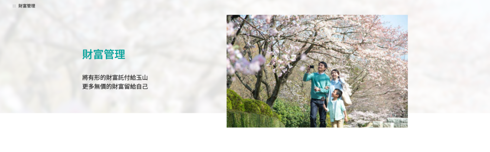
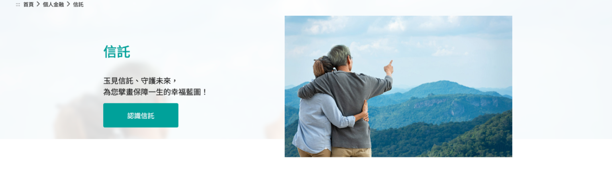
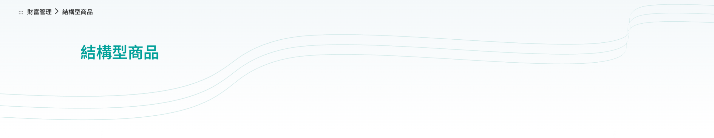
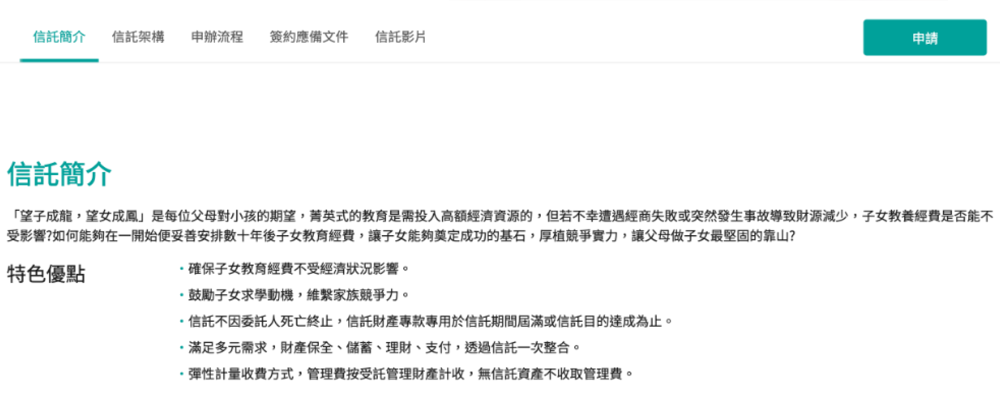
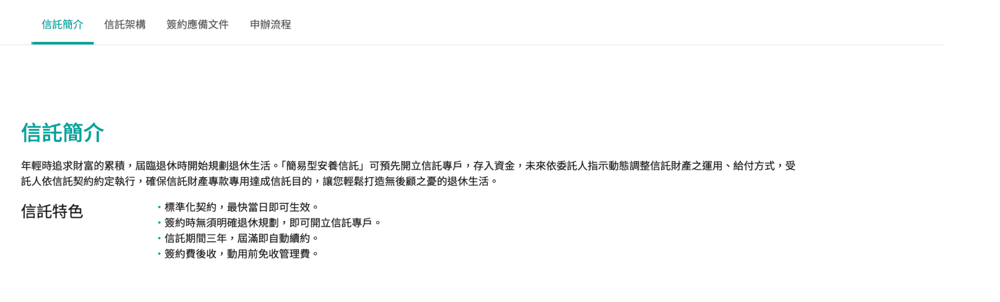
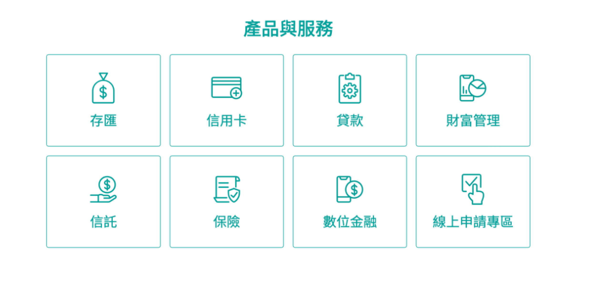
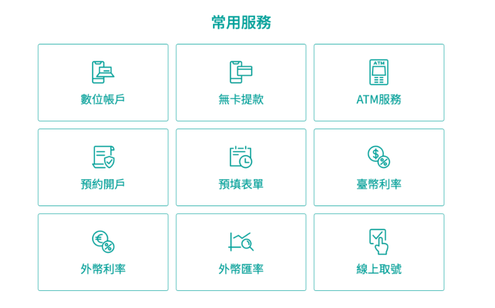
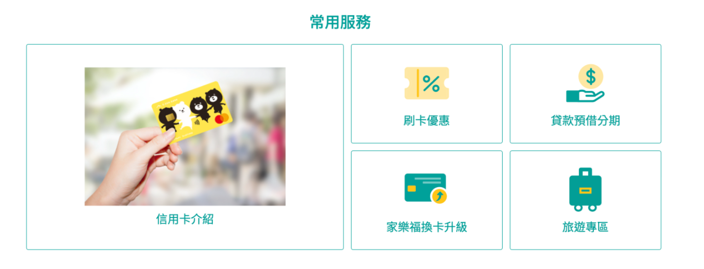

# 官網 eventpage
> 統整官網公版樣式，如KV區塊、選單區塊、常用服務區塊、卡片區塊與內容區塊，提供使用者快速瀏覽與維持官網一致的服務。 
>  [➚ Figma](https://www.figma.com/design/omxTr5PtVk1GtGg4RkQJlM/layout%E7%9B%A4%E9%BB%9E?node-id=1-55&m=dev){.color-primary-6}

## KV區塊

左文右圖

    

 

左文右圖 加按鈕

    

 

公版線條背景

    

 

文字背景填滿

    

## 選單區塊

選單加按鈕

    

 

選單無按鈕

    

 

## 常用服務區塊

四欄式

    

 

三欄式

    

 

三欄式

    

## 卡片區塊

## 內容區塊

