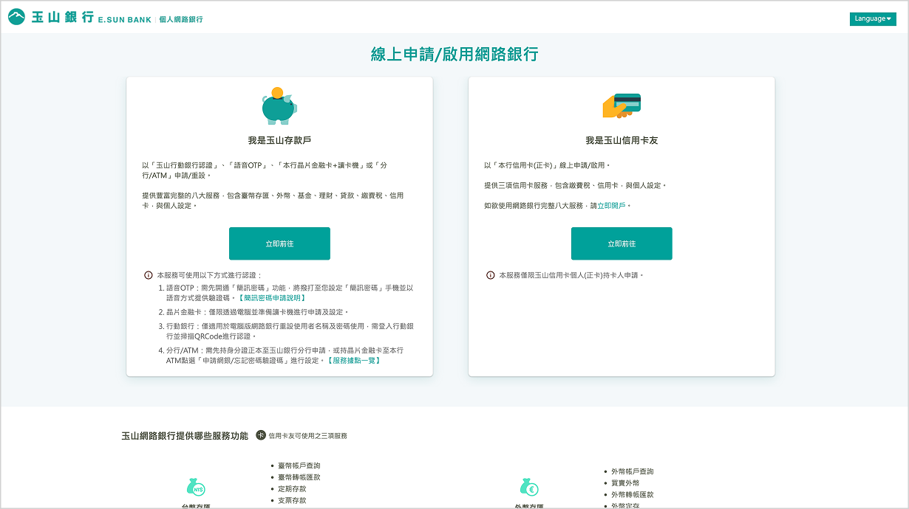
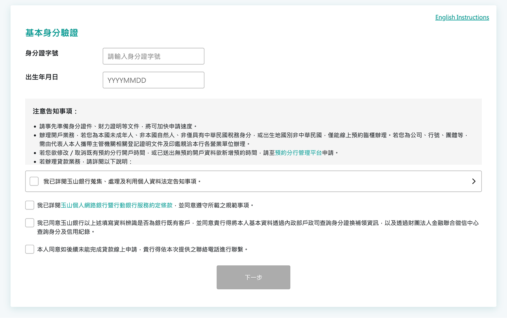
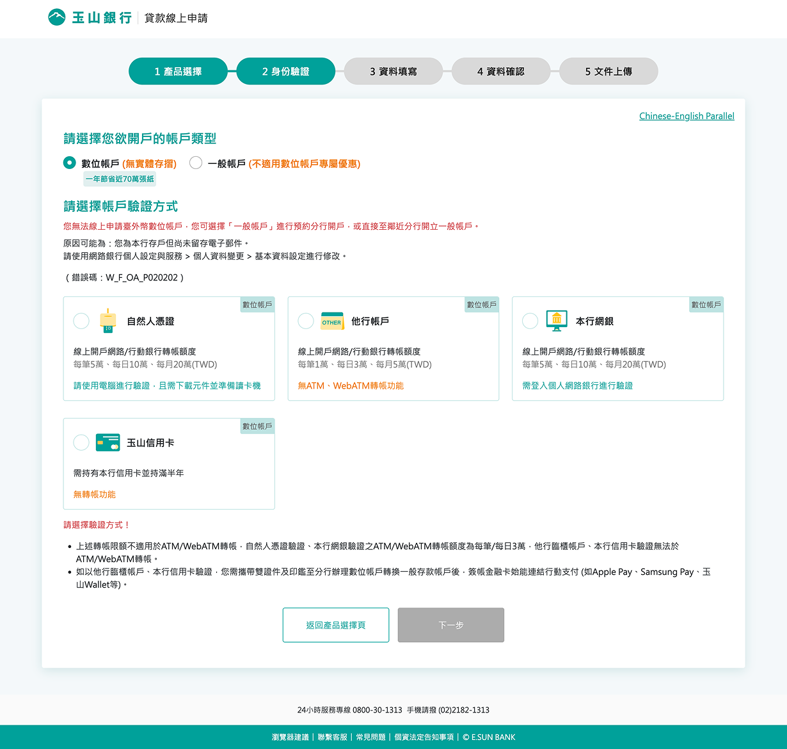
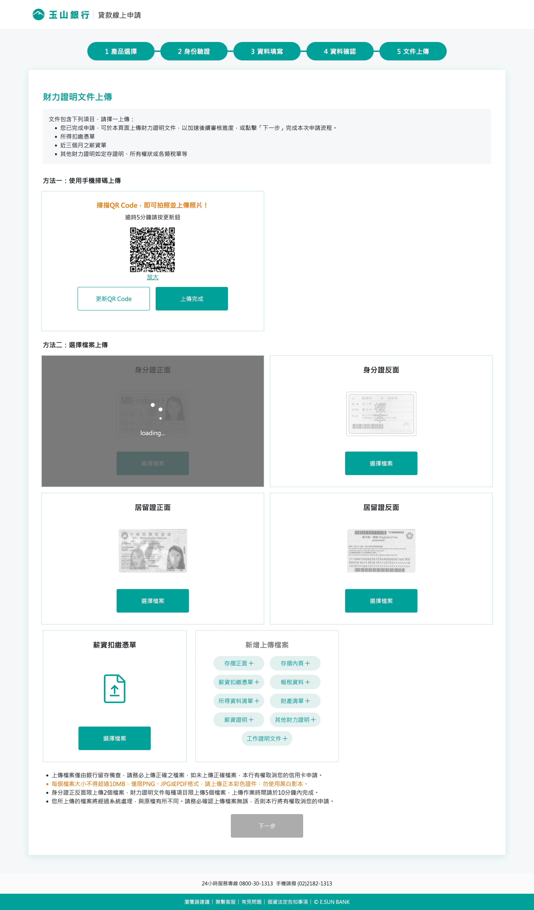
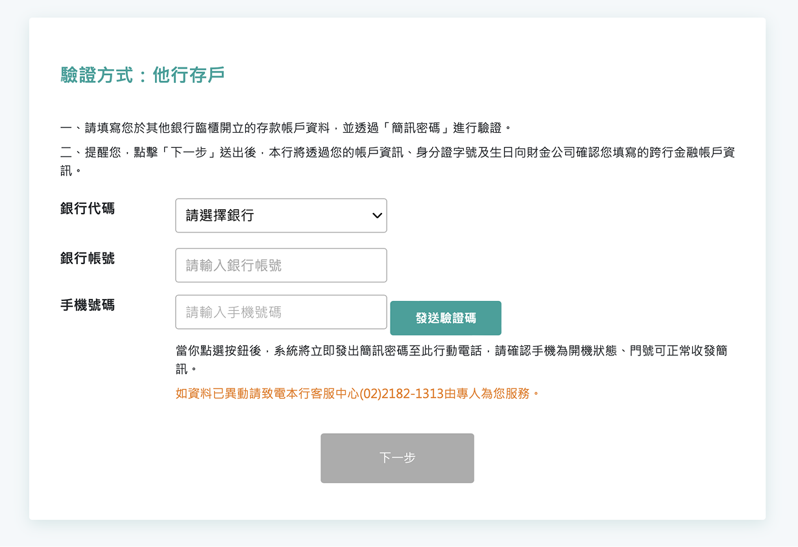
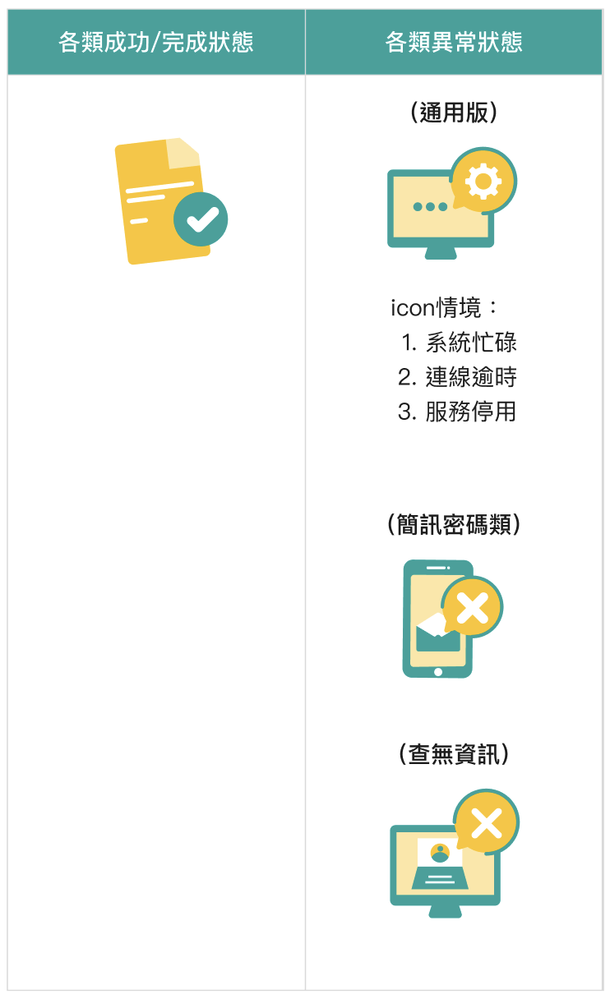
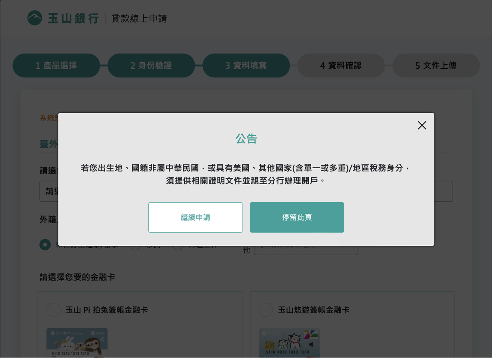
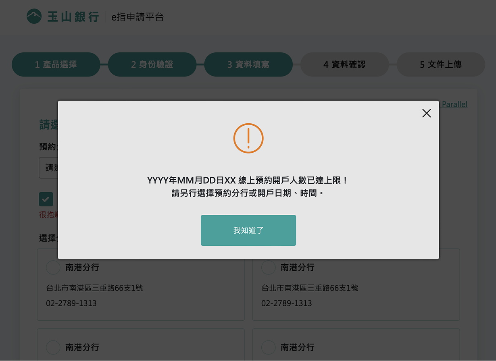

# 流程頁面 processpage 
> 根據各服務需求，制定一致的操作流程與視覺規範，以利顧客在進行服務申請過程可以更加流暢與快速。 
> 本區簡單介紹現行流程頁中會使用的固定格式，但如果個別元件需要確認，請參考uikit各元件說明 
> [➚ Figma](https://www.figma.com/design/omxTr5PtVk1GtGg4RkQJlM/layout%E7%9B%A4%E9%BB%9E?node-id=1-55&m=dev){.color-primary-6}

## 入口頁

    <table class="table table-bordered w1000">
        <thead class="bg-primary-8">
            <tr>
                <th scope="col">類別</th>
                <th scope="col">一欄式</th>
                <th scope="col">兩欄式</th>
            </tr>
        </thead>
        <tbody>
            <tr>
                <td width="10%" class="bg-primary-2">
                    
示意

                </td>
                <td width="45%">
                    
                </td>
                <td width="45%">
                    
                </td>
            </tr>
            <tr>
            <td>
            說明
            </td>
            <td colspan="2">
            依照需求選擇一/兩欄式入口頁面使用。
            </td>
            </tr>
        </tbody>
    </table>

## 身份驗證頁

    <table class="table table-bordered w1000">
        <thead class="bg-primary-8">
            <tr>
                <th scope="col">類別</th>
                <th scope="col">單一驗證</th>
                <th scope="col">複合驗證</th>
            </tr>
        </thead>
        <tbody>
            <tr>
                <td width="10%" class="bg-primary-2">
                    
示意

                </td>
                <td width="45%">
                    
                    
                </td>
                <td width="45%">
                    
                </td>
            </tr>
            <tr>
            <td>
            說明
            </td>
            <td colspan="2">
            依照提供的驗證渠道來決定選擇樣式。 
            單一驗證頁面當中，依照填寫欄位來選擇。 
            ＊注意此處如選擇為無icon的資料填寫形式，格式應為單欄式，且標題與輸入格為一列。
            </td>
            </tr>
        </tbody>
    </table>

## 步驟頁

    <table class="table table-bordered w1000">
        <thead class="bg-primary-8">
            <tr>
                <th scope="col">類別</th>
                <th scope="col">步驟圖示意</th>
            </tr>
        </thead>
        <tbody>
            <tr>
                <td width="10%" class="bg-primary-2">
                    
示意

                </td>
                <td width="45%">
                    
                </td>
            </tr>
            <tr>
            <td>
            說明
            </td>
            <td>
            依照需要的步驟數量制定。 
            在使用時會分為已完成步驟、進行中步驟、尚未進行步驟，對應不同狀態。 
            ＊注意步驟數量最多為六個。
            </td>
            </tr>
        </tbody>
    </table>

## 資料頁

    <table class="table table-bordered w1000">
        <thead class="bg-primary-8">
            <tr>
                <th scope="col">類別</th>
                <th scope="col">資料類別選擇</th>
                <th scope="col">資料上傳</th>
            </tr>
        </thead>
        <tbody>
            <tr>
                <td width="10%" class="bg-primary-2">
                    
示意

                </td>
                <td width="45%">
                    
                </td>
                <td width="45%">
                    
                </td>
            </tr>
            <tr>
            <td>
            說明
            </td>
            <td>
            本項為固定格式，在需要選擇辦理業務類別時使用。
            </td>
            <td>
            本項為固定格式，在需要上傳審核文件時使用，可依照需求點擊新增上傳文件欄位。
            </td>
            </tr>
        </tbody>
    </table>

    <table class="table table-bordered w1000">
        <thead class="bg-primary-8">
            <tr>
                <th scope="col">類別</th>
                <th scope="col">大量資料填寫</th>
                <th scope="col">少量資料填寫</th>
            </tr>
        </thead>
        <tbody>
            <tr>
                <td width="10%" class="bg-primary-2">
                    
示意

                </td>
                <td width="45%">
                    
                </td>
                <td width="45%">
                    
                </td>
            </tr>
            <tr>
            <td>
            說明
            </td>
            <td>
            當使用者需要填寫大量資料，會採用左右雙排的資料填寫形式，且資料表頭與內容為上下排列，以此放入更多的填寫欄位，避免頁面過長、過多。
            </td>
            <td>
            當資料量較少時，可以選擇使用單行形式進行填寫，建議當資料呈現單行式，可以在單一頁面中呈現時使用，如單行呈現會超出單頁，則建議使用雙行排列，減少流程頁數。
            </td>
            </tr>
        </tbody>
    </table>

## 資料確認頁

    <table class="table table-bordered w1000">
        <thead class="bg-primary-8">
            <tr>
                <th scope="col">類別</th>
                <th scope="col">線上確認</th>
                <th scope="col">下載確認</th>
            </tr>
        </thead>
        <tbody>
            <tr>
                <td width="10%" class="bg-primary-2">
                    
示意

                </td>
                <td width="45%">
                    
                </td>
                <td width="45%">
                    
                </td>
            </tr>
            <tr>
            <td>
            說明
            </td>
            <td colspan="2">
            依照是否需要另外下載為準，如果需要提供下載檔案，會提供製作好的pdf形式，線上確認則依資料填寫頁格式。
            </td>
            </tr>
        </tbody>
    </table>

## 服務申請

    <table class="table table-bordered w1000">
        <thead class="bg-primary-8">
            <tr>
                <th scope="col">類別</th>
                <th scope="col">申請成功</th>
                <th scope="col">申請失敗</th>
            </tr>
        </thead>
        <tbody>
            <tr>
                <td width="10%" class="bg-primary-2">
                    
示意

                </td>
                <td width="45%">
                    
                </td>
                <td width="45%">
                    
                </td>
            </tr>
            <tr>
            <td>
            說明
            </td>
            <td colspan="2">
            根據申請成功、失敗給予不同回饋，前方icon則配合不同申請類別。
            目前使用類別有以下種類，詳細資訊可前往元件進行查看。 
            
            </td>
            </tr>
        </tbody>
    </table>

## 彈跳視窗

    <table class="table table-bordered w1000">
        <thead class="bg-primary-8">
            <tr>
                <th scope="col">類別</th>
                <th scope="col">標題版</th>
                <th scope="col">Icon版</th>
            </tr>
        </thead>
        <tbody>
            <tr>
                <td width="10%" class="bg-primary-2">
                    
示意

                </td>
                <td width="45%">
                    
                </td>
                <td width="45%">
                    
                </td>
            </tr>
            <tr>
            <td>
            說明
            </td>
            <td colspan="2">
            根據跳窗顯示文字與情況，決定是否需要有Icon警示。
            </td>
            </tr>
        </tbody>
    </table>

