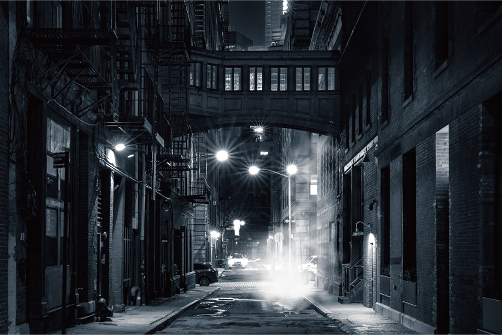

# Photo 照片

## 用圖規範

選圖原則： 
挑選照片需符合內文情境，以真實、明亮清新為主。 
科技類圖像可因應主題，使用合成圖的方式呈現科技感。

  

    

        
正確範例︎ - 明亮、清新

        
    

    

        
錯誤範例 - 灰暗、沈重

        
    

  

  

    

        
正確範例︎︎ - 呈現科技感

        
    

    

        
正確範例︎︎ - 呈現科技感

        
    

  

肖像： 
以本行行員為主。 
以正向的情緒，呈現專業與親切感。

  

    

        
正確範例︎ - 本行行員

        
    

    

        
錯誤範例 - 非本行行員

        
    

  

  

    

        
正確 - 呈現專業與親切感

        
    

    

        
錯誤 - 負面情緒

        
    

  

