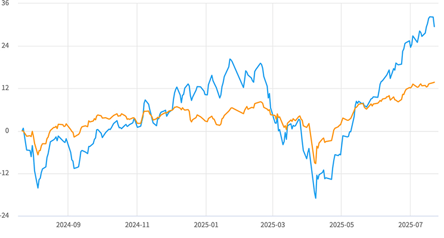
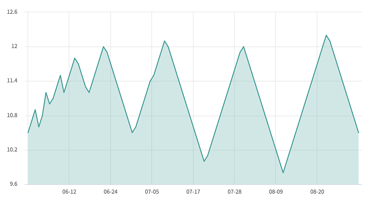
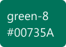
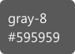
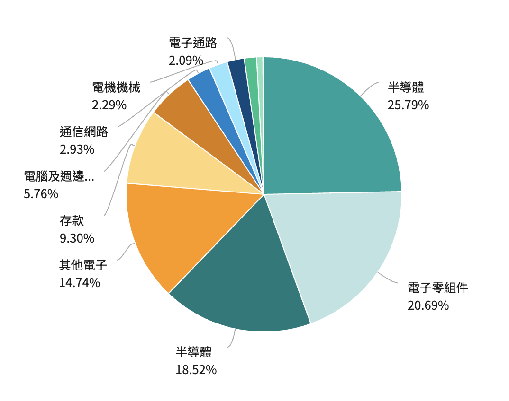
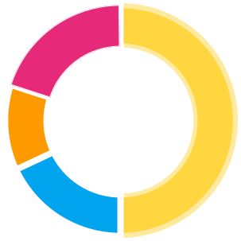

# Chart 圖表
> 將資料的差異對比和變化趨勢變得一目瞭然，有助於快速、有效地表達資料關係。

<script setup>
    import LineChart from '../components/Chart-LineChart.vue'
    import AreaChart from '../components/Chart-AreaChart.vue'
    import PieChart from '../components/Chart-PieChart.vue'
</script>

## 線性圖Line Chart

<LineChart />

## 程式碼
::: code-group

```html [html]
<div id="LineChart"></div>
```

```js [js]
// 引用插件 <script src="highcharts.js"></script>
Highcharts.chart('LineChart', {
    chart: { 
        type: 'line' 
    },
    title: { 
        text: '圖表名稱',
        style: {
            fontSize: '18px',
            color: '#00a19b',
            fontWeight: 'bold'
        }
    },
    xAxis: {
        categories: ['Jan', 'Feb', 'Mar'],
        gridLineWidth: 1,
        labels: {
            align: 'left',
            style: {
                fontSize: '14px'
            }
        }
    },
    yAxis: [{
        title: {
            text: null
        },
        labels: {
            style: {
                fontSize: '14px'
            }
        },
        showFirstLabel: false,
      },{
        linkedTo: 0,
        gridLineWidth: 0,
        opposite: true,
        title: {
            text: null
        },
        labels: {
            style: {
                fontSize: '14px'
            }
        },
        showFirstLabel: false
    }],
    legend: {
        align: 'left',
        margin: 50,
        verticalAlign: 'top',
        borderWidth: 0,
        itemStyle: {
        fontWeight: 'medium',
        color: '#1C1C1C',
        fontSize: '16px'
        }
    },
    tooltip: {
        shared: true,
        crosshairs: true,
        borderColor: '#d9d9d9',
        style: {
            fontSize: '14px'
        }
    },
    plotOptions: {
        series: {
            cursor: 'pointer',
            className: 'popup-on-click',
            marker: {
                lineWidth: 1
            }
        }
    },
    series: [{ 
        name: '銀行賣出',
        color: '#1DA4EF',
        data: [1, 3, 2],
        lineWidth: 2,
        market: {
            radius: 4
        }, 
      },{
        name: '銀行買入',
        color: '#FD9A01',
        data: [2, 1, 3],
        lineWidth: 2,
        market: {
            radius: 4
        },
    }],
    credits: {
        enabled: false
    }

})
```
:::

## 面積圖Area Chart 

<AreaChart />

## 程式碼
::: code-group

```html [html]
<div id="AreaChart"></div>
```

```js [js]
// 引用插件 <script src="highcharts.js"></script>
Highcharts.chart('AreaChart', {
    chart: { 
        type: 'area' 
    },
    title: {
          text: '圖表名稱',
          style: {
            fontSize: '18px',
            color: '#00a19b',
            fontWeight: 'bold'
          }
    },
    xAxis: {
        categories: ['Jan', 'Feb', 'Mar'],
        gridLineWidth: 1,
        labels: {
            align: 'left',
            style: {
                fontSize: '14px'
            }
        }
    },
    yAxis: [{
        title: {
            text: null
        },
        tickAmount: 6,
      },{
        linkedTo: 0,
        gridLineWidth: 0,
        opposite: true,
        title: {
            text: null
        },
        labels: {
            style: {
                fontSize: '14px'
            }
        },
        showFirstLabel: false
    }],
    legend: {
        enabled: false
    },
    plotOptions: {
        area: {
            lineWidth: 2,
            lineColor: '#00a19b',
            states: {
              hover: {
                lineWidth: 2
              }
            },
            threshold: null
          },
        series: {
            cursor: 'pointer',
            marker: {
              enabled: false,
              symbol: 'circle',
              radius: 4,
              fillColor: '#00a19b',
              lineWidth: 1
            }
          }
    },
    series: [{
          name: '淨值',
          color: 'rgba(0, 161, 155, 0.7)',
          fillOpacity: 0.25,
          data: [1, 3, 2]
        }],
    credits: {
        enabled: false
    }

})
```
:::

## 圓餅圖Pie Chart

<PieChart />

## 程式碼
::: code-group

```html [html]
<div id="PieChart"></div>
```

```js [js]
// 引用插件 <script src="highcharts.js"></script>
Highcharts.chart('PieChart', {
    chart: { 
        type: 'pie' 
    },
    colors: [
        '#00A19B', '#BDE3E2', '#007A7A', '#FF9900', '#FFD77A', '#D97B00',
        '#0083C9', '#93E6FE', '#00497D', '#00C08B', '#87E3BF', '#00735A', '#D9D9D9', '#595959'
    ],
    title: {
          text: '圖表名稱',
          style: {
            fontSize: '18px',
            color: '#00a19b',
            fontWeight: 'bold'
          }
    },
      plotOptions: {
        pie: {
          allowPointSelect: true,
          cursor: 'pointer',
          dataLabels: {
            enabled: true,
            format: '<b>{point.name}</b>: {point.percentage:.1f} %',
            connectorColor: '#acacac',
            style: {
              fontSize: '13px',
            }
          },
        }
      },
          series: [{
        name: '占比',
        data: [
          { name: '項目1', y: 8 },
          { name: '項目2', y: 7 },
          { name: '項目3', y: 10 },
          { name: '項目4', y: 12 },
          { name: '項目5', y: 9 },
          { name: '項目6', y: 6 },
          { name: '項目7', y: 8 },
          { name: '項目8', y: 7 },
          { name: '項目9', y: 5 },
          { name: '項目10', y: 6 },
          { name: '項目11', y: 8 },
          { name: '項目12', y: 4 }
        ]
      }],
    credits: {
        enabled: false
    }

})
```
:::

## 元件規範

<div class="table-responsive">
    <table class="table table-bordered w1000">
        <thead class="bg-primary-8">
            <tr>
                <th scope="col"></th>
                <th scope="col" colspan="3">All media</th>
            </tr>
        </thead>
        <tbody>
            <tr>
                <p>圖表使用付費插件highcharts生成<br>目前官網使用v10.2版本</p>
            </tr>
            <tr>
                <td rowspan="6" class="bg-primary-2" scope="row">
                    <p class="text-gray-11">顏色定義</p>
                </td>
                <td>
                    <b style="margin-bottom:16px;display: block;">線性圖Line Chart</b></br>
                    <div style="display: flex;column-gap: 12px;margin-bottom:16px">
                        
                        <p class="text-gray-11">銀行買入、比較項目1</p>
                        
                        <p class="text-gray-11">銀行賣出、比較項目2</p>
                    </div>
                    
                </td>
            </tr>
            <tr>
                <td>
                    <b style="margin-bottom:16px;display: block;">面積圖Area Chart </b></br>
                    <div style="display: flex;column-gap: 12px;margin-bottom:16px">
                        
                        <p class="text-gray-11">線條顏色</p>
                        
                        <p class="text-gray-11">opacity:0.25 面積背景色</p>
                    </div>
                    
                </td>
            </tr>
            <tr>
                <td>
                    <b style="margin-bottom:16px;display: block;">圓餅圖Pie Chart & 環形圖Donut chart</b></br><b style="margin: 0px;" class="text-gray-11">依照比例大>小</b></br>
                    <div style="display: flex;column-gap: 12px;margin-bottom:16px;flex-wrap: wrap;align-items: center;row-gap: 8px;">
                        <div><p style="margin: 0px;" class="text-gray-11">1.</p>
                        </div>
                        <div><p style="margin: 0px;" class="text-gray-11">2.</p>
                        </div>
                        <div><p style="margin: 0px;" class="text-gray-11">3.</p>
                        </div>
                        <div><p style="margin: 0px;" class="text-gray-11">4.</p>
                        </div>
                        <div><p style="margin: 0px;" class="text-gray-11">5.</p>
                        </div>
                        <div><p style="margin: 0px;" class="text-gray-11">6.</p>
                        </div>
                        <div><p style="margin: 0px;" class="text-gray-11">7.</p>
                        </div>
                        <div><p style="margin: 0px;" class="text-gray-11">8.</p>
                        </div>
                        <div><p style="margin: 0px;" class="text-gray-11">9.</p>
                        </div>
                        <div><p style="margin: 0px;" class="text-gray-11">10.</p>
                        </div>
                        <div><p style="margin: 0px;" class="text-gray-11">11.</p>
                        </div>
                        <div><p style="margin: 0px;" class="text-gray-11">12.</p>
                        </div>
                        <div><p style="margin: 0px;" class="text-gray-11">13.</p>
                        </div>
                        <div><p style="margin: 0px;" class="text-gray-11">14.</p>
                        </div>
                    </div>
                    
                    <b style="margin-bottom: 0px;" class="text-gray-11">依照產品</b>
                    <div style="display: flex;column-gap: 12px;margin-bottom:16px;flex-wrap: wrap;align-items: center;row-gap: 8px;">
                        <div><p style="margin: 0px;" class="text-gray-11">臺幣存款</p>
                        </div>
                        <div><p style="margin: 0px;" class="text-gray-11">外幣存款</p>
                        </div>
                        <div><p style="margin: 0px;" class="text-gray-11">投資</p>
                        </div>
                        <div><p style="margin: 0px;" class="text-gray-11">信用卡 <span style="color:#EF4343">*調整guideline色</span></p>
                        </div>
                        <div><p style="margin: 0px;" class="text-gray-11">證券</p>
                        </div>
                        <div><p style="margin: 0px;" class="text-gray-11">貸款</p>
                        </div>
                    </div>
                    
                </td>
            </tr>
        </tbody>
    </table>
</div>