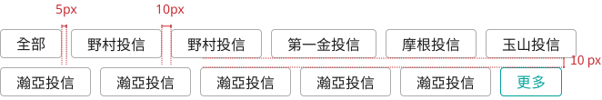
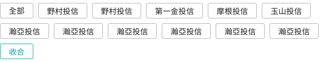

# Filters 篩選器
> 透過條件的設定篩選資料庫，只顯示想要看到的資料。

<script setup>
import Filters from '../components/Filters.vue'
</script>

## 元件預覽
<Filters />

## 程式碼
::: code-group

```html [html]
<div class="l-filters">
    <div class="l-filters--btn btnAll">全部</div>
    <div class="l-filters--line"></div>
    <div class="l-filters--btnGroup">
        <div class="l-filters--btn">野村投信</div>
        <div class="l-filters--btn">第一金投信</div>
        <div class="l-filters--btn">摩根投信</div>
        <div class="l-filters--btn">玉山投信</div>
        <div class="l-filters--btn">瀚亞投信</div>
        <div class="l-filters--btn">野村投信</div>
        <div class="l-filters--btn">第一金投信</div>
        <div class="l-filters--btn">摩根投信</div>
        <div class="l-filters--btn">玉山投信</div>
        <div class="l-filters--btn">瀚亞投信</div>
        <div class="l-filters--btn">摩根投信</div>
        <div class="l-filters--btn">玉山投信</div>
        <div class="l-filters--btn">瀚亞投信</div>
    </div>
    <div class="l-filters--btn btnMore">更多</div>
</div>
```

```css [css]
.l-filters{
max-width:500px;
}
.l-filters--btnGroup{
display: inline;
}
.l-filters--btn{
min-width:100px;
padding:4px 18px;
font-size:16px;
border:solid 1px #ACACAC;
border-radius:4px;
margin:10px 5px;
display: inline-block;
text-align: center;
cursor:pointer;
}
.l-filters--btn:hover{
opacity:0.8
}
.l-filters--btn.btnAll{
margin-right:5px;
min-width: auto;
}
.l-filters--btn.btnMore{
min-width: auto;
border:solid 1px #00a19b;
color:#00a19b;
}
.l-filters--line{
display: inline-block;
width: 1px;
background-color: #D9D9D9;
height: 32px;
vertical-align: middle;
}
```
```js [js]
const buttons = document.querySelectorAll('.l-filters--btn');
    const btnAll = document.querySelector('.btnAll');

    buttons.forEach(button => {
      // 排除 btnMore，不做 active 切換或改變 btnAll 狀態
      if (button.classList.contains('btnMore')) {
        return; 
      }

      button.addEventListener('click', () => {
        button.classList.toggle('active');
        if (btnAll.classList.contains('active')) {
          btnAll.classList.remove('active');
        }
      });
    });

    if (btnAll) {
      btnAll.addEventListener('click', () => {
        buttons.forEach(button => {
          button.classList.remove('active');
        });
        btnAll.classList.add('active');
      });
    }

    const btnGroup = document.querySelector('.l-filters--btnGroup');
    const btnMore = document.querySelector('.btnMore');
    const btnGroupBtns = btnGroup.querySelectorAll('.l-filters--btn');
    const maxVisible = 10;

    if (btnGroupBtns.length > maxVisible) {
      for (let i = maxVisible; i < btnGroupBtns.length; i++) {
        btnGroupBtns[i].style.display = 'none';
      }
      btnMore.style.display = 'inline-block';
      btnMore.textContent = '更多';
    } else {
      btnMore.style.display = 'none';
    }

    if (btnMore) {
      btnMore.addEventListener('click', () => {
        // btnMore 點擊不會改變 btnAll 狀態或任何 active 狀態
        const isExpanded = btnMore.textContent === '收合';
        if (isExpanded) {
          for (let i = maxVisible; i < btnGroupBtns.length; i++) {
            btnGroupBtns[i].style.display = 'none';
          }
          btnMore.textContent = '更多';
        } else {
          for (let i = maxVisible; i < btnGroupBtns.length; i++) {
            btnGroupBtns[i].style.display = 'inline-block';
          }
          btnMore.textContent = '收合';
        }
      });
    }
```
:::

## 元件規範

<div class="table-responsive">
    <table class="table table-bordered w1000">
        <thead class="bg-primary-8">
            <tr>
                <th scope="col"></th>
                <th scope="col" colspan="3">All media</th>
            </tr>
        </thead>
        <tbody>
            <tr>
                <td rowspan="3" class="bg-primary-2" scope="row">
                    <p class="text-gray-11">:defualt</p>
                </td>
                <td>
                    
                </td>
                <td>
                    
                </td>
                <td>
                    
                </td>
            </tr>
            <tr>
                <td>
                    <b>選項按鈕</b>
                    <ul class="pl-3 my-1">
                        <li>min-width:100px</li>
                        <li>border:solid 1px #ACACAC</li>
                        <li>color:#1c1c1c</li>
                        <li>padding:4px 18px</li>
                        <li>font-size:16px</li>
                        <li>border-radius:4px</li>
                    </ul>
                </td>
                <td>
                    <b>全選按鈕</b>
                    <ul class="pl-3 my-1">
                        <li>min-width:auto</li>
                        <li>其他設定同左</li>
                    </ul>
                    <b>分隔線</b>
                    <ul class="pl-3 my-1">
                        <li>width:1px</li>
                        <li>height:32px</li>
                        <li>background-color:#D9D9D9</li>
                    </ul>
                </td>
                <td>
                    <b>展開收合按鈕</b>
                    <ul class="pl-3 my-1">
                        <li>min-width:auto</li>
                        <li>border:solid 1px #00a19b</li>
                        <li>color:#00a19b</li>
                        <li>其他設定同左</li>
                    </ul>
                </td>
            </tr>
            <tr>
                <td colspan="3">
                    
                </td>
            </tr>
            <tr>
                <td rowspan="4" class="bg-primary-2" scope="row">
                    <p class="text-gray-11">:active</p>
                </td>
                <td colspan="3">
                    
                </td>
            </tr>
            <tr>
                <td colspan="3">
                    <b>選項按鈕、全選按鈕</b>
                    <ul class="pl-3 my-1">
                        <li>background-color:#00a19b</li>
                        <li>border:solid 1px #00a19b</li>
                    </ul>
                </td>
            </tr>
            <tr>
                <td colspan="3">
                    
                </td>
            </tr>
            <tr>
                <td colspan="3">
                    <ul class="pl-3 my-1">
                        <li>如果全選按鈕是:active狀態，其他選項將取消:active</li>
                    </ul>
                </td>
            </tr>
            <tr>
                <td rowspan="2" class="bg-primary-2" scope="row">
                    <p class="text-gray-11">group type</p>
                </td>
                <td colspan="3">
                    
                </td>
            </tr>
            <tr>
                <td colspan="3">
                    <ul class="pl-3 my-1">
                        <li>若超過10個選項，顯示更多的按鈕接在選項最後方</li>
                    </ul>
                </td>
            </tr>
            <tr>
                <td rowspan="2" class="bg-primary-2" scope="row">
                    <p class="text-gray-11">group type:active</p>
                </td>
                <td colspan="3">
                    
                </td>
            </tr>
            <tr>
                <td colspan="3">
                    <ul class="pl-3 my-1">
                        <li>點擊更多後，文案切換成收合</li>
                    </ul>
                </td>
            </tr>
        </tbody>
    </table>
</div>