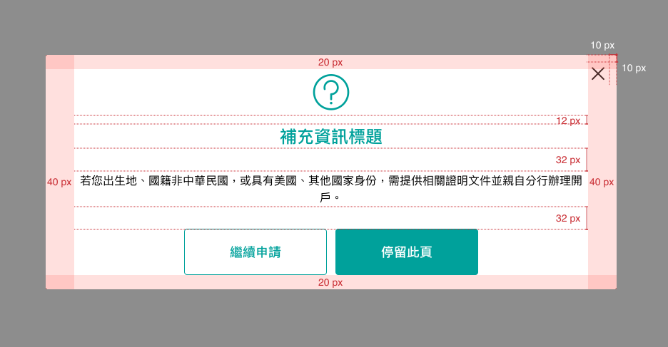
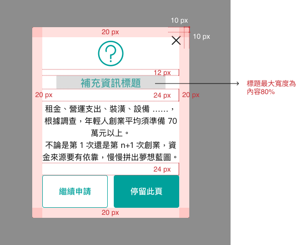
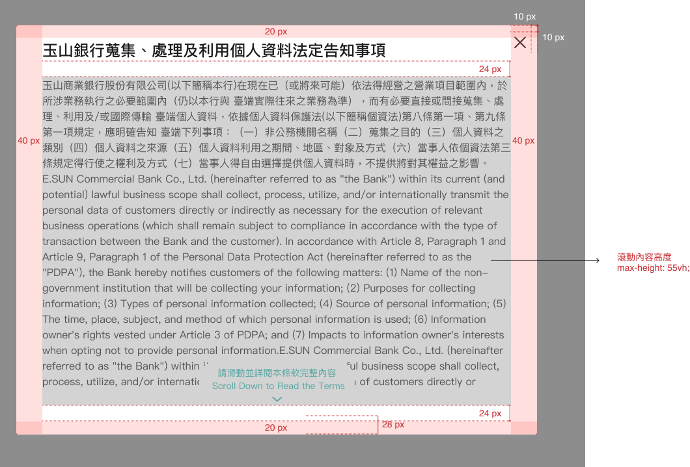
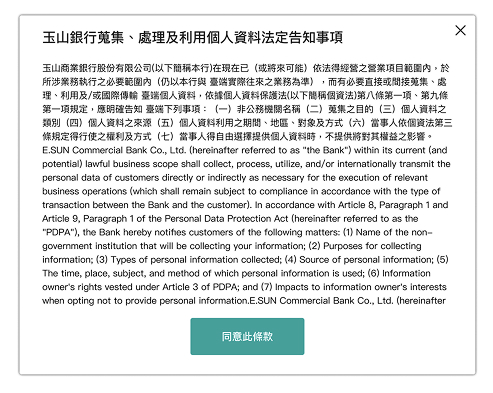
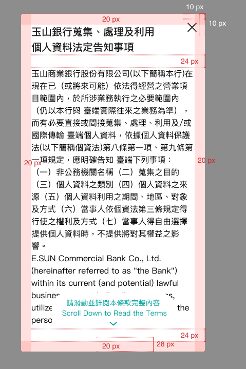

# Modals 彈跳視窗
> 會跳出到網頁的最上層，以向使用者傳達重要訊息、提示、警告或執行操作。

<script setup>
  import Modals from '../components/Modals.vue'
</script>

## 元件預覽
<Modals />

## 程式碼
::: code-group

```html [html(Modals_Message)]
<div class="l-modals">
  <a class="show-popup" href="#" data-showpopup="1">Modals_Message-textLeft</a>、<a class="show-popup" href="#"
    data-showpopup="2">Modals_Message-textCenter</a>、<a class="show-popup" href="#"
    data-showpopup="3">Modals_Message-additional</a>、<a class="show-popup" href="#"
    data-showpopup="4">Modals_Message-Notice</a>
  <!-- 彈跳視窗內容放置區 -->
  <div class="overlay-bg">
    <div class="overlay"></div>
    <div class="l-modals--message textLeft popup" id="popup1">
      <div class="close-btn" href=""></div>
      <p class="l-modals--title">注意事項</p>
      <div class="dragscroll scrollAreaWrapper">
        <p>創業需要準備多少資金？</p>
        <p>租金、營運支出、裝潢、設備 ……，根據調查，年輕人創業平均須準備 70 萬元以上。<br>不論是第 1 次還是第 n+1 次創業，資金來源要有依靠，慢慢拼出夢想藍圖。</p>
      </div>
      <div class="btnGroup">
        <a class="btn btnLine" href="#">次要按鈕</a>
        <a class="btn" href="#">主要按鈕</a>
      </div>
    </div>
  </div>
  <div class="overlay-bg">
    <div class="overlay"></div>
    <div class="l-modals--message textCenter popup" id="popup2">
      <div class="close-btn" href="">
      </div>
      <p class="l-modals--title">公告</p>
      <div class="dragscroll scrollAreaWrapper">
        <p>若您出生地、國籍非屬中華民國，或具有美國、其他國家(含單一或多重)/地區稅務身分，須提供相關證明文件並親至分行辦理開戶。</p>
      </div>
      <div class="btnGroup">
        <a class="btn btnLine" href="#">次要按鈕</a>
        <a class="btn" href="#">主要按鈕</a>
      </div>
    </div>
  </div>
  <div class="overlay-bg">
    <div class="overlay"></div>
    <div class="l-modals--message additional popup" id="popup3">
      <div class="close-btn" href="">
        
      </div>
      
      <p class="l-modals--title">補充資訊標題</p>
      <div class="dragscroll scrollAreaWrapper">
        <p>若您出生地、國籍非屬中華民國，或具有美國、其他國家(含單一或多重)/地區稅務身分，須提供相關證明文件並親至分行辦理開戶。</p>
      </div>
      <div class="btnGroup">
        <a class="btn btnLine" href="#">次要按鈕</a>
        <a class="btn" href="#">主要按鈕</a>
      </div>
    </div>
  </div>
  <div class="overlay-bg">
    <div class="overlay"></div>
    <div class="l-modals--message notice popup" id="popup4">
      <div class="close-btn" href="">
        
      </div>
      
      <p class="l-modals--title">補充資訊標題</p>
      <div class="dragscroll scrollAreaWrapper">
        <p>檔案無法辨識，請重新上傳。</p>
      </div>
      <div class="btnGroup">
        <a class="btn btnLine" href="#">次要按鈕</a>
        <a class="btn" href="#">主要按鈕</a>
      </div>
    </div>
  </div>
</div>
```
```html [html(Modals_Terms)]
  <div class="l-modals">
    <a class="show-popup" href="#" data-showpopup="5">Modals_Terms</a>
    <!-- 彈跳視窗內容放置區 -->
    <div class="overlay-bg">
      <div class="overlay"></div>
      <div class="l-modals--terms popup" id="popup5">
        <div class="close-btn" href="">
        
      </div>
        <p class="l-modals--title">玉山銀行蒐集、處理及利用個人資料法定告知事項</p>
        <div class="dragscroll scrollAreaWrapper">
          <div class="scrollArea">
            <a class="text-link" href="#" target="_blank">下載全部條款</a>
            <p>茲因本人向玉山銀行(以下簡稱貴行)申請開立數位存款帳戶，本人同意並願意遵守以下
              數位存款帳戶開戶特別約定條款以及貴行「開戶總約定書」(路徑:法定公開揭露事項→定型
              化契約專區→開戶總約定書-目前為DG325A 2018.01)之相關約定，本人同時已審閱全部內容
              （審閱期間至少五日）後，方進行申請開戶：
            </p>
            <table>
              <tbody>
                <tr>
                  <td align="right" valign="top">壹、</td>
                  <td>本人瞭解數位存款帳戶僅提供具簽帳功能的Debit金融卡，同時不提供存摺，亦毋須約
                    定留存印鑑作為支付及約定相關依據。</td>
                </tr>
                <tr>
                  <td align="right" valign="top">貳、</td>
                  <td>本人知悉並瞭解開戶總約定書所記載之「玉山銀行蒐集、處理及利用個人資料法定告知
                    事項」之內容，且貴行向本存戶蒐集個人資料時，已依據個人資料保護法(以下稱個資
                    法)第八條第一項規定，明確告知本存戶下列事項：(1)非公務機關名稱(2)蒐集之目的
                    (3)個人資料之類別(4)個人資料利用之期間、地區、對象及方式(5)當事人依個資法第
                    三條規定得行使之權利及方式(6)當事人得自由選擇提供個人資料時，不提供將對其權
                    益之影響
                  </td>
                </tr>
                <tr>
                  <td align="right" valign="top">叁、</td>
                  <td>本人同意貴行、財團法人金融聯合聯徵中心、票據交換所、聯合信用卡處理中心、財金
                    資訊公司或其他往來金融機構及國內外金融事務處理相關機構等對業務所需，得依法令
                    規定蒐集、處理(包括委託第三人處理)及利用本人之個人資料。
                  </td>
                </tr>
                <tr>
                  <td align="right" valign="top">肆、</td>
                  <td>本人同意，數位存款帳戶無適用開戶總約定書以下章節，本人倘有需求，須另至貴行申
                    請轉換一般存款帳戶後，方能適用：
                    <table>
                      <tbody>
                        <tr>
                          <td valign="top">第四章</td>
                          <td>支票存款約定條款
                            <ol style="list-style: none;padding-left: 0px;">
                              <li>一、支票存款特別約定條款</li>
                              <li>二、支票存款約定書補充條款</li>
                            </ol>
                          </td>
                        </tr>
                        <tr>
                          <td valign="top">第七章</td>
                          <td>電子銀行服務約定條款
                            <ol style="list-style: none;padding-left: 0px;">
                              <li>三、企業網路銀行服務約定條款</li>
                            </ol>
                          </td>
                        </tr>
                        <tr>
                          <td valign="top">第十章</td>
                          <td>黃金存摺開戶約定條款</td>
                        </tr>
                      </tbody>
                    </table>
                  </td>
                </tr>
                <tr>
                  <td align="right" valign="top">伍、</td>
                  <td>若本人申請之數位存款帳戶屬信用卡驗證(第三類)數位存款帳戶，則無法申請金融卡、
                    網路銀行約定非本人帳戶轉帳功能以及非約定帳戶轉帳功能。</td>
                </tr>
                <tr>
                  <td align="right" valign="top">陸、</td>
                  <td>本人瞭解貴行就數位存款帳戶不受理臨櫃存款或臨櫃銷戶以外之帳務性交易；若有上述
                    以外之臨櫃交易需求時，本人得申請轉換為一般存摺存款帳戶。</td>
                </tr>
                <tr>
                  <td align="right" valign="top">柒、</td>
                  <td>本人同意持數位存款帳戶首次臨櫃處理非帳務性交易時，必須提供雙證件及同意貴行查
                    詢聯徵中心，並經首次驗證無誤後，方得執行。</td>
                </tr>
              </tbody>
            </table>

            <div class="d-flex justify-content-center">
              <a class="btn term-agree-btn ">同意</a>
            </div>
          </div>
        </div>
        <p class="scrollDown_btn">請滑動並詳閱本條款完整內容<br>Scroll Down to Read the Terms
        </p>
      </div>
    </div>
  </div>
```

```css [css]
  /* 客製化樣式 */
  .l-modals--message.textLeft {
  text-align: left;
  }

  .l-modals--message.textCenter,
  .l-modals--message.additional,
  .l-modals--message.notice {
  text-align: center;
  }

  .l-modals--message.textCenter .btnGroup,
  .l-modals--message.additional .btnGroup,
  .l-modals--message.notice .btnGroup {
  justify-content: center;
  }

  .l-modals--message.notice .l-modals--title {
  color: #EF7800;
  }

  .l-modals--terms .l-modals--title {
  color: #1c1c1c;
  margin: 0px;
  }

  /* 共用樣式 */
  .l-modals .show-popup {
  font-size: 16px;
  color: #00a19b;
  text-decoration: underline;
  display: inline-block;
  }

  .l-modals--title {
  color: #00a19b;
  font-size: 20px;
  font-weight: bold;
  width: 96%;
  margin: 0 auto;
  margin-left: 0;
  }

  .l-modals--icon {
  width: 64px;
  height: 64px;
  margin: 0 auto;
  display: block;
  margin-bottom: 12px;
  }

  .active-body {
  overflow: hidden;
  }

  .overlay-bg {
  display: none;
  position: fixed;
  top: 0;
  left: 0;
  height: 100%;
  width: 100%;
  z-index: 1000;
  }

  .overlay {
  position: absolute;
  top: 0;
  left: 0;
  height: 100%;
  width: 100%;
  cursor: pointer;
  z-index: 1001;
  /* fallback */
  background: rgba(0, 0, 0, 0.7);
  }

  .popup {
  display: block;
  background: #fff;
  position: absolute;
  -webkit-box-sizing: border-box;
  box-sizing: border-box;
  max-width: 1000px;
  top: 50%;
  left: 50%;
  width: 92%;
  padding: 20px;
  max-height: 100vh;
  height: auto;
  word-break: break-all;
  -webkit-transform: translate(-50%, -50%);
  transform: translate(-50%, -50%);
  cursor: default;
  z-index: 10001;
  border-radius: 4px;
  -webkit-box-shadow: 0 0 5px rgba(0, 0, 0, 0.9);
  box-shadow: 0 0 5px rgba(0, 0, 0, 0.9);
  }

  .popup .scrollAreaWrapper {
  max-height: 70vh;
  background-color: transparent;
  padding: 20px;
  padding-left: 0px;
  padding-bottom: 0px;
  padding-top: 0px;
  margin-top: 24px;
  overflow-y: auto;
  overflow-x: hidden;
  scrollbar-width: thin;
  scrollbar-color: #acacac #f0f0f0;
  }

  .popup .scrollAreaWrapper::-webkit-scrollbar {
  width: 6px;
  }

  .popup .scrollAreaWrapper::-webkit-scrollbar-track {
  background: #f0f0f0;
  }

  .popup .scrollAreaWrapper::-webkit-scrollbar-thumb {
  background: #acacac;
  border-radius: 20px;
  }

  .popup .scrollAreaWrapper p {
  margin: 0px;
  }

  .popup .scrollAreaWrapper ul {
  list-style: none;
  margin-left: -14px;
  font-size: 16px;
  margin-top: 0;
  }

  .popup .scrollAreaWrapper ul li::before {
  content: "•";
  padding-right: 8px;
  }

  .popup .scrollAreaWrapper ul ol {
  padding-left: 22px;
  }

  .popup .scrollAreaWrapper ul ol li {
  text-indent: 0px;
  }

  .popup .scrollAreaWrapper ul>li {
  padding-top: 2px;
  text-indent: -18px;
  }

  .btnGroup {
  display: flex;
  justify-content: center;
  }

  .btn {
  background-color: #00a19b;
  border-radius: 4px;
  width: 200px;
  height: 65px;
  box-sizing: border-box;
  color: #fff;
  display: flex;
  align-items: center;
  justify-content: center;
  margin: 24px 6px;
  margin-bottom: 0px;
  }

  .btnLine {
  background-color: #fff;
  color: #00a19b !important;
  }

  .close-btn {
  position: absolute;
  top: 10px;
  cursor: pointer;
  right: 10px;
  }

  .popup .scrollDown_btn {
  position: absolute;
  bottom: 20px;
  left: 50%;
  -webkit-transform: translateX(-50%);
  transform: translateX(-50%);
  background-color: #fff;
  -webkit-box-shadow: 0px 0px 4px 2px #d9d9d9;
  box-shadow: 0px 0px 4px 2px #d9d9d9;
  color: #00a19b;
  border-radius: 30px;
  font-weight: bold;
  padding: 10px 15px;
  margin-bottom: 8px;
  cursor: pointer;
  width: 80%;
  max-width: 250px;
  text-align: center;
  font-size: 14px;
  line-height: 1.5;
  }

  .popup .scrollDown_btn svg {
  margin: 0 auto;
  display: block;
  }

  @media (prefers-color-scheme: dark) {
  .popup {
  background: #e6e6e6;
  }
  }

  @media (min-width: 768px) {
  .popup {
  width: 80%;
  padding: 20px 40px;
  }

  .popup .scrollAreaWrapper {
  margin-top: 32px;
  }

  .l-modals--title {
  font-size: 24px;
  margin: 0 auto;
  }

  .btnGroup {
  justify-content: left;
  }

  .btn {
  margin: 32px 6px;
  margin-bottom: 0px;
  }

  .l-modals--message.textLeft .btnGroup .btn:nth-child(1) {
  margin-left: 0px;
  }

  .l-modals--message.textLeft .l-modals--title {
  margin-left: 0px;
  }

  }
  ```
  ```js [js]
  $('.scrollDown_btn').click(function () {
    $(this).siblings('.scrollAreaWrapper').animate({
      scrollTop: $(this).siblings('.scrollAreaWrapper').find('.scrollArea').height()
    });
    $(this).css('display', 'none');
    $(this).parents('.scrollAreaWrapperOut').find('input').prop('disabled', false);
    $(this).parents('.popup').find('.term-agree-btn').removeClass('btnDisabled')
  })

  function showPopup(whichpopup) {
    $('#popup' + whichpopup).parent().fadeIn(200);
    $('body').addClass('active-body');
    $('#popup' + whichpopup).find('.scrollAreaWrapper').scroll(function () {

      var clientHeight = $(this).height();
      var scrollTop = $(this).scrollTop();

      var scrollHeight = $(this).find(".scrollArea").height();
      if (scrollTop + clientHeight + 1 >= scrollHeight) {

        $(this).parents('.popup').find('.term-agree-btn').removeClass('btnDisabled')
        $(this).siblings('.scrollDown_btn').css('display', 'none')

        $(".term-open").click(function () {
          $(this).find('.scrollAreaWrapper').animate({
            scrollTop: (scrollHeight)
          }, 0);
        })
        $(this).parents('.popup').find('.term-agree-btn').click(function () {
          $(this).parents('.popup_term').find('input').attr("checked", true);
          $(this).addClass('d-none')
        })
        $(this).parents('.popup_term').find('input').prop('disabled', false);
      }
    })
    $('#popup' + whichpopup).find('.term-agree-btn').click(function () {
      $(this).addClass('d-none')
      $(this).parents('.popup_term').find('input').attr("checked", true).prop('disabled',false);
    })
  }

  function closePopup() {
    $('.overlay-bg').fadeOut(200);
    $('body').removeClass('active-body');
  };
  
  $('.show-popup').click(function (event) {
    event.preventDefault();
    var selectedPopup = $(this).data('showpopup');
    showPopup(selectedPopup);
  });

  $('.close-btn, .overlay, .term-agree-btn').click(function () {
    closePopup();
    $('body').removeClass('active-body');
  });

  $(document).keyup(function (e) {
    if (e.keyCode == 27) {
      closePopup();
      $('body').removeClass('active-body');
    }
  });

```
:::

## 元件規範

<b>Modals_Message</b>

<div class="table-responsive">
    <table class="table table-bordered w1000">
        <thead class="bg-primary-8">
            <tr>
                <th scope="col"></th>
                <th scope="col" colspan="3">(> 768px)</th>
            </tr>
        </thead>
        <tbody>
            <tr>
                <td rowspan="3" class="bg-primary-2" scope="row">
                    <p class="text-gray-11">:defualt</p>
                </td>
                <td>
                    
                </td>
            </tr>
            <tr>
                <td>
                    <b>共同樣式</b>
                    <ul class="pl-3 my-1">
                        <li>背景色：#1C1C1C  opacity 50%</li>
                        <li>內容寬度：width:80% max-width: 800px</li>
                        <li>內容高度：max-height: 80vh;</li>
                        <li>內容卡片：border-radius:4px/box-shadow: 0 0 5px #000000 90%</li>
                        <li>關閉icon：32x32px/additional&notice icon：64x64px</li>
                        <li>標題：font-size:24px/font-weight:bold</li>
                        <li>內容：font-size:16px</li>
                    </ul>
                    <b>個別樣式</b>
                    <p class="pl-3 my-1">Modals_Message-notice 標題顏色：#EF7800，其他標題顏色：#00a19b</p>
                </td>
            </tr>
        </tbody>
    </table>
    <table class="table table-bordered w1000">
        <thead class="bg-primary-8">
            <tr>
                <th scope="col"></th>
                <th scope="col" colspan="3">(≤ 768px)</th>
            </tr>
        </thead>
        <tbody>
            <tr>
                <td rowspan="3" class="bg-primary-2" scope="row">
                    <p class="text-gray-11">:defualt</p>
                </td>
                <td>
                    
                </td>
            </tr>
            <tr>
                <td>
                    <b>共同樣式</b>
                    <ul class="pl-3 my-1">
                        <li>內容寬度：width:92%</li>
                        <li>標題：font-size:20px/font-weight:bold</li>
                        <li>內容：font-size:16px</li>
                        <li>其他同上</li>
                    </ul>
                </td>
            </tr>
        </tbody>
    </table>
</div>

<b>Modals_Terms</b>

<div class="table-responsive">
    <table class="table table-bordered w1000">
        <thead class="bg-primary-8">
            <tr>
                <th scope="col"></th>
                <th scope="col" colspan="3">(> 768px)</th>
            </tr>
        </thead>
        <tbody>
            <tr>
                <td rowspan="5" class="bg-primary-2" scope="row">
                    <p class="text-gray-11">:defualt</p>
                </td>
                <td>
                    
                </td>
            </tr>
            <tr>
                <td>
                    <ul class="pl-3 my-1">
                        <li>背景色：#1C1C1C  opacity 50%</li>
                        <li>內容寬度：width:80% max-width: 800px</li>
                        <li>內容高度：max-height: 80vh;</li>
                        <li>內容卡片：border-radius:4px/box-shadow: 0 0 5px #000000 90%</li>
                        <li>關閉icon：32x32px</li>
                        <li>標題：font-size:24px/font-weight:bold</li>
                        <li>內容：font-size:16px</li>
                    </ul>
                </td>
            </tr>
            <tr>
                <td>
                    
                </td>
            </tr>
            <tr>
                <td>
                    <ul class="pl-3 my-1">
                        <li>Scroll Down Btn點擊後畫面滾至最下方，顯示同意按鈕</li>
                        <li>Scroll Down Btn樣式：box-shadow:0px 0px 4px 2px #d9d9d9/border-radius:30px/font-size:14px/color:#00a19b/icon:32x32px</li>
                    </ul>
                </td>
            </tr>
            <tr>
                <td>
                    
                </td>
            </tr>
        </tbody>
    </table>
        <table class="table table-bordered w1000">
        <thead class="bg-primary-8">
            <tr>
                <th scope="col"></th>
                <th scope="col" colspan="3">(≤ 768px)</th>
            </tr>
        </thead>
        <tbody>
            <tr>
                <td rowspan="3" class="bg-primary-2" scope="row">
                    <p class="text-gray-11">:defualt</p>
                </td>
                <td>
                    
                </td>
            </tr>
            <tr>
                <td>
                    <ul class="pl-3 my-1">
                        <li>標題：font-size:20px/font-weight:bold</li>
                        <li>內容：font-size:16px</li>
                        <li>其他樣式同上</li>
                    </ul>
                </td>
            </tr>
        </tbody>
    </table>
</div>