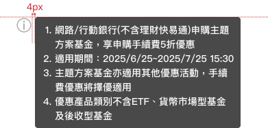

# Tooltips 工具提示
> 當使用者將游標懸停時，彈出一個視窗顯示該元素的相關資訊或說明。

<script setup>
    import Tooltips from '../components/Tooltips.vue'
</script>

## 元件預覽
<p>:hover顯示</p>

<Tooltips />

## 程式碼
::: code-group

```html [html]
<div class="l-tooltips">
    
    <div class="l-tooltips--content vertical">
        <ul>
            <li>網路/行動銀行(不含理財快易通)申購主題方案基金，享申購手續費5折優惠</li>
            <li>適用期間：2025/6/25~2025/7/25 15:30</li>
            <li>主題方案基金亦適用其他優惠活動，手續費優惠將擇優適用</li>
            <li>優惠產品類別不含ETF、貨幣市場型基金及後收型基金</li>
        </ul>
    </div>
</div>
```

```css [css]
.l-tooltips{
position: relative;
display: inline-block;
}
.l-tooltips:hover .l-tooltips--content{
display: block;
}
.l-tooltips--img {
width: 24px;
height: 24px;
}
.l-tooltips--content {
display: none;
position: absolute;
max-width: 300px;
border-radius:4px;
background-color: rgb(28 28 28 / 80%);
padding: 8px;
font-size: 14px;
color: #fff;
z-index: 2;
}
.l-tooltips--content.vertical{
left: 28px;
top: 0px;
}
.l-tooltips--content.horizontal{
left: 50%;
transform: translate(-50%);
top: 28px;
}
.l-tooltips--content ul{
margin: 0px;
}
.l-tooltips--content ul li{
font-size: 14px;
color: #fff;
}
```
:::

## 元件規範

<div class="table-responsive">
    <table class="table table-bordered w1000">
        <thead class="bg-primary-8">
            <tr>
                <th scope="col"></th>
                <th scope="col" colspan="3">All media</th>
            </tr>
        </thead>
        <tbody>
            <tr>
                <td rowspan="2" class="bg-primary-2" scope="row">
                    <p class="text-gray-11">:defualt</p>
                </td>
                <td colspan="2">
                    
                </td>
            </tr>
            <tr>
                <td colspan="2">
                    <p>尺寸：24x24</p>
                    
                </td>
            </tr>
            <tr>
                <td rowspan="2" class="bg-primary-2" scope="row">
                    <p class="text-gray-11">:hover</p>
                </td>
                <td>
                    <p>vertical</p>
                    
                </td>
                <td>
                    <p>horizontal</p>
                    
                </td>
            </tr>
            <tr>
                <td colspan="2">
                    <ul class="pl-3 my-1">
                        <li>內容可視情況放在右側或上方</li>
                        <li>background-color: rgb(28 28 28 / 80%)</li>
                        <li>border-radius:4px</li>
                        <li>font-size:14px</li>
                        <li>padding:8px</li>
                        <li>width: max-width:300px</li>
                    </ul>
                </td>
            </tr>
        </tbody>
    </table>
</div>