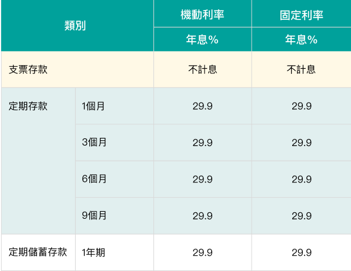
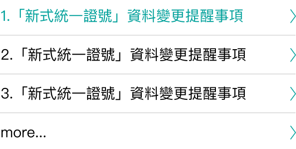
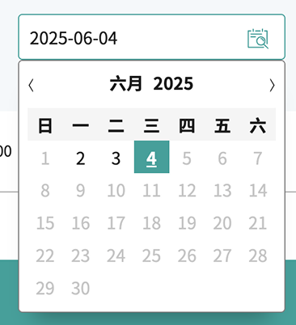

# UIKit
> 元件庫與介面工具套件

## 說明文件
透過SCSS的方式組建專案樣式，再依據編譯環境進行配置，並建議使用reset.css進行初始化樣式。
<a class="btnLine" href="#">variable.scss</a> 
<a class="btnLine" href="#">reset.css</a>

## 元件總覽

  

    

        
    

    

        
    

    

        
    

    

        
    

    

        
    

    

        
    

    

        
    

    

        
    

    

        
    

  

